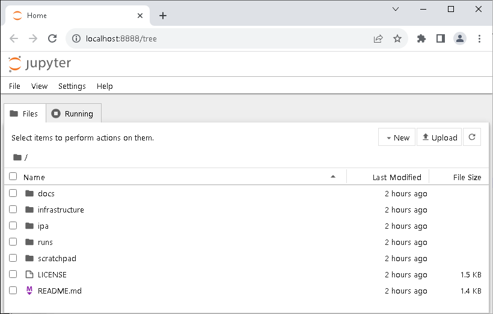
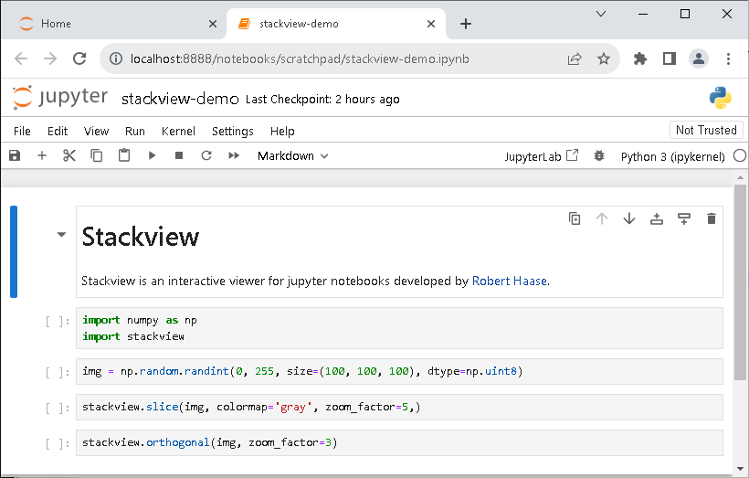
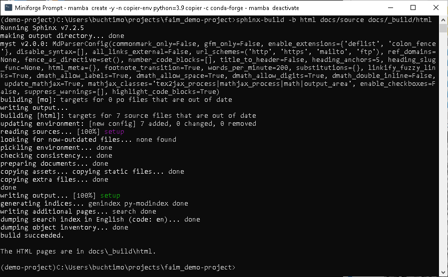
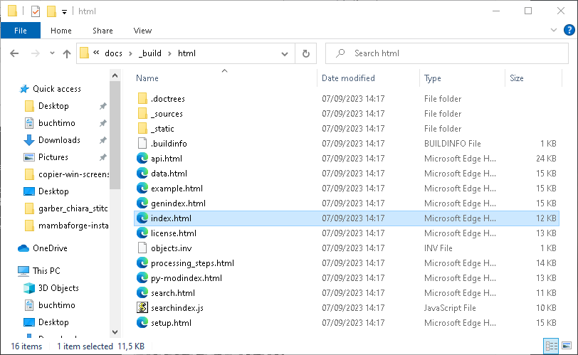
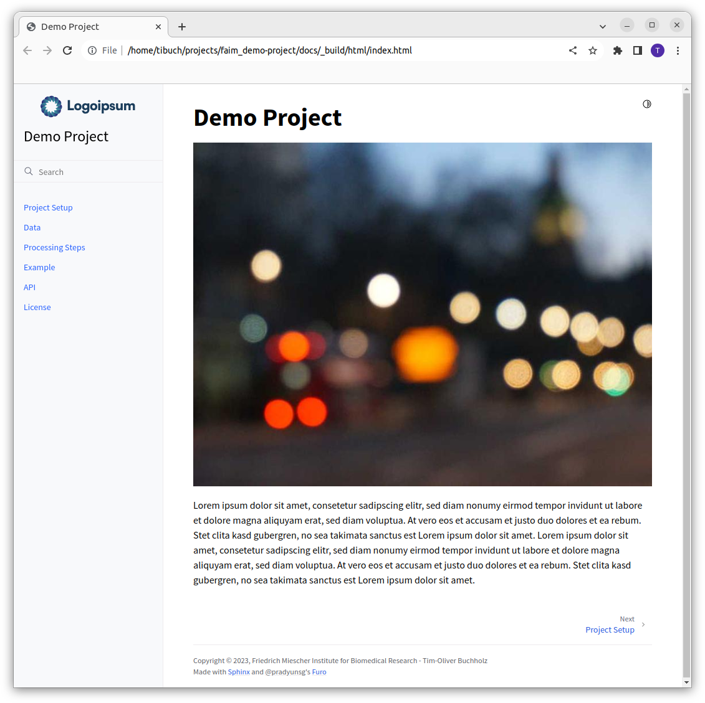

# Working with your Project
Our vision for image processing and analysis projects is to grow with you.
When you start you are most likely still trying out different tools and ideas on your data.
This is the time where the `scratchpad` comes in handy.
Just drop all your ongoing notes and code snippets in there and keep on developing.

With time you will start developing more advanced codes and scripts.
When you have reached a point where a certain script is stable and you want to use it to run on more than just the test image, it is time to move it from `scratchpad` to `ipa`.
In the `ipa` directory we want to keep scripts which are used to process our data and obtain solid results.
This also means that we might have to invest a little time into documenting our functions and make the script runnable with a config file.
Having a config file makes it easier to re-run the same script on different data.

Now that you have your first script, which can be reused on different data, it is time to spend a little time on documentation.
We prepared your project to use [shpinx](https://www.sphinx-doc.org/en/master/) to render a nice website with your documentation.
For now this website can only be seen locally on your machine.
However, only a few steps are necessary to publish the whole documentation and project description, making your project accessible to others.

```{note}
Here, we will give a short introduction to Python for image processing and analysis. However, you can use any tool you like for your data analysis (e.g. Fiji, MATLAB, R, ...).
```

## Jupyter Notebook
We have already created the Python environment in the last step of the [installation guide](./installation_guide.md#build-python-ipa-environment) and it should currently be active i.e. your command line prompt is prefixed with the environment name.

Enter the following command to start a jupyter server:

```bash
jupyter notebook
```

A lot of text will start appearing in your command line and it will stay blocked while the server is running:


Simultaneously, a browser window should have opened:



Since we have started the jupyter server out of our project root directory we can see all its contents.

You can navigate through the directories and inspect all files.
For now we want to change into `scratchpad` and double click on `stackview-demo.ipynb`.



You can execute the code-cells by pressing the small play button `▶︎`.


To terminate the jupyter server hit `Ctrl + C` twice in your command line prompt.


## `ipa` Scripts
We provide some example scripts in the `ipa` directory.
However, we do not run them inside the `ipa` directory, but inside the `runs` directory.
Each run should get its own run-directory.
So far we have a run-directory called `example`.
If you start fresh it does only contain a `README.md` file, outlining how to run the scripts in `ipa`.

Our approach is to have a script to build a config file and a script to run the computation for each processing step.
The build config script will ask the user for input parameters and write them into a config file.

To build a new `preprocessing_config.yaml` file enter the following command:

```bash
python ..\..\ipa\s01_preprocessing\build_preprocessing_config.py
```

After answering all questions the `preprocessing_config.yaml` will appear in the `example` directory.
Now you can run the preprocessing script with:

```bash
python ..\..\ipa\s01_preprocessing\run_preprocessing.py
```


After running the script a log-file will appear in the `example` directory.


## Build `docs`
The last step is to build the documentation website.
For this you simply run this command from the project root directory:

```bash
sphinx-build -b html docs/source docs/_build/html
```



The built html pages are now available in `docs/source/_build/html`:



Open the `index.html` page with your browser and you can start browsing through your documentation:



This is a static website, which is at the moment only available on your machine.
You can take the whole `html` directory and host it somewhere if you want to make the contents publicly available.


### Updating the Documentation
The source for the documentation is stored in `docs/source`:

**index.md**
: This is the welcome page of your documentation. Its content is a copy of the content between `<!-- start abstract -->` and `<!-- end abstract -->` in the root directory `README.md`. Like this we don't have to worry about updating the abstract in two places.

**setup.md**
: Contains information about installing the necessary tools. The content is included from `infrastructure/README.md`.

**data.md**
: This is the first page which does not take any information from anywhere. This is the place to provide more information about the data of your project.

**processing_steps.md**
: This is a mixed file. The beginning is imported from `runs/example/README.md`. The second half describes the individual processing steps in plain language.

**example.md**
: It is always nice to have a small example in your documentation. It should be something that runs in seconds, but still demonstrates what and how it is done.

**api.md**
: This is the most advanced part of the documentation. We use the [sphinx autodoc](https://www.sphinx-doc.org/en/master/usage/extensions/autodoc.html) functionality to list all our documented Python functions automatically.

**license.md**
: This just displays the license from the `LICENSE` file in the root directory.

Everytime you change one of the `README.md` files, doc-strings in the `ipa` scripts or one of the above files you must rebuild the documentation to get an updated website.
